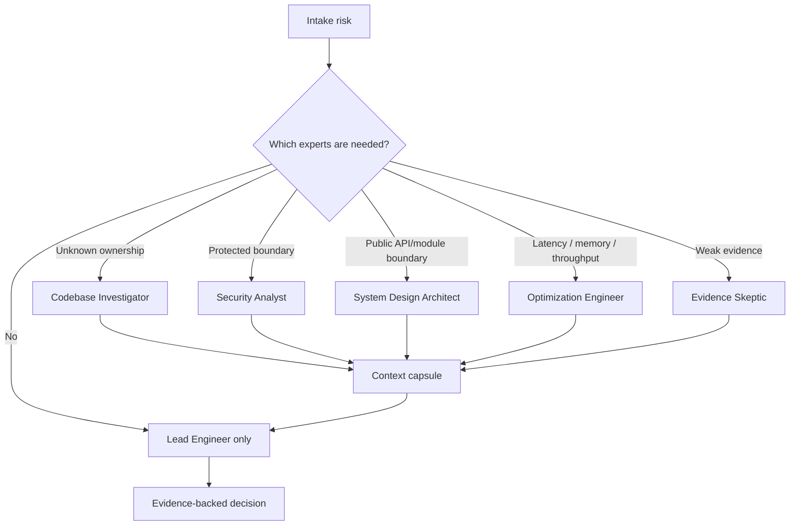

<p align="center">
  <picture>
    <source media="(prefers-color-scheme: dark)" srcset="docs/assets/engineering-team-hero-dark.svg">
    <source media="(prefers-color-scheme: light)" srcset="docs/assets/engineering-team-hero-light.svg">
    
  </picture>
</p>

# EngineeringTeam

[](https://github.com/daeon/EngineeringTeam/actions/workflows/validate.yml)
[](LICENSE)


**Give your AI coding agent an expert software engineering team.**

EngineeringTeam is a repo-first workflow layer that makes one coding agent operate like a coordinated panel of software engineering experts. For each task, a lead engineer frames the problem, selects the smallest useful set of specialists, gets them oriented on the repo and affected contracts, gates the decision with evidence, and only then makes the targeted implementation or hands back a diagnosis.

> Stop asking one agent to guess. Give it the right expert panel, shared repo understanding, and an evidence gate before it edits.

## ⚡ In thirty seconds

Most coding agents are fast, but speed is not judgment. Real engineering work needs the right mix of skills: someone to map ownership, someone to test the contract, someone to challenge weak evidence, and domain specialists for security, performance, migration, architecture, or release risk when those risks are real.

EngineeringTeam turns that team habit into a reusable skill that works across the agent you already use. It does not add a runtime service, network calls, or session-start magic. You invoke `engineering-team` when a task deserves expert coordination: it chooses the right panel, makes the panel understand the problem from source evidence, and produces compact, human-reviewable artifacts as it goes.

When ambiguity itself is the first risk, EngineeringTeam can run an optional unknowns-first pre-intake pass before normal classification. That pass is for non-trivial ambiguous, risky, unfamiliar, architecture-sensitive, security-sensitive, production-impacting, or assumption-heavy work. It stays lightweight and feeds the existing Intake, Alignment, Evidence, Gate, Run Ledger, and Final Report artifacts.

That panel can deliver a PR-ready implementation, a read-only diagnosis, a repo map, a hypothesis matrix, a log report, a performance probe plan, or a handoff for another session. The point is not “change code” versus “understand code.” The point is: assemble the right experts, establish shared understanding, then make the smallest safe move.

Read-only mode means **no edits**; it does not mean low rigor. Trivial local explanations can use L0, while broad codebase analysis, root-cause work, performance analysis, protected-boundary review, migration review, release planning, and multi-component PR review still use L2-L5 depth according to complexity and risk.

Use `handoff` when you want the current task transferred to another agent or a fresh session. It compacts the work into a continuation document with decisions, evidence, open questions, artifact links, suggested skills, and next actions.

Specialist agents are **selective, not mandatory**. EngineeringTeam does not spawn a fixed committee; it forms the smallest expert panel that covers the task's distinct risks.

## 🧠 How it works

```mermaid
flowchart LR
    request[User request] --> ambiguity{Ambiguity risky?}
    ambiguity -->|Optional| unknowns[Unknowns-first pre-intake]
    ambiguity -->|No| lead{Lead engineer intake}
    unknowns --> lead

    lead --> mode{Outcome needed?}
    mode -->|Fix / feature / refactor| impl[Implementation mode]
    mode -->|Understand / debug / logs / perf| analysis[Read-only analysis mode]
    mode -->|Continue elsewhere| handoff[Handoff mode]

    impl --> panel[Select expert panel]
    analysis --> panel
    panel --> depth[Assign L0-L5 depth]

    depth --> atlas[Repo Atlas]
    atlas --> brief[Component Brief]
    brief --> contracts[Contract Graph]
    contracts --> evidence[Evidence Ledger]
    evidence --> gate{Implementation Gate}
    gate -->|Pass| patch[Small safe patch]
    gate -->|Read-only| report[Diagnosis / report / next probes]
    patch --> verify[Verification Report]
    report --> closeout[Run Ledger / Context GC]
    verify --> closeout

    handoff --> capsule[Continuation document]
```



## 🧭 Pick the right workflow

| I need to... | Use | Typical output |
|---|---|---|
| Fix, implement, refactor, or prepare a PR | `engineering-team` | Lead + implementation + verification experts; Repo Atlas → Component Brief → Contract Graph → Evidence Ledger → Implementation Gate → Verification Report → Final Report |
| Understand an unfamiliar repository | `engineering-team` routes to `codebase-analysis` | Lead + codebase investigator; component map, call paths, contracts, findings, confidence, unknowns |
| Investigate a bug without patching yet | `engineering-team` routes to `debugging-forensics` | Lead + debugging/evidence/test panel; hypothesis matrix, supporting/counter evidence, falsifying probes, fix readiness |
| Analyze logs or noisy failure output | `engineering-team` routes to `log-forensics` | Lead + log forensics lens; timeline, signals, findings, redactions, ruled-out claims, next probes |
| Investigate latency, throughput, memory, or locking | `engineering-team` routes to `performance-forensics` | Lead + optimization/verification experts; measurement frame, hot-path map, bottleneck hypotheses, probe-first recommendations |
| Transfer work to another agent or fresh session | `handoff` | Continuation document with decisions, evidence, risks, suggested skills, and next actions |

The main `engineering-team` skill is the lead engineer. It decides whether the task needs implementation, read-only analysis, or handoff, then assembles the right panel around the risk: codebase investigation, debugging forensics, log forensics, performance, security, architecture, migration, release, verification, evidence skepticism, or advisory review. If an investigation uncovers a likely fix, the agent should hand off an evidence-backed diagnosis and verification strategy before editing unless you explicitly ask it to implement.

### L0 fast path boundary

Use L0 only for trivial local explanation, simple summary, or obvious one-file inspection with no cross-file, behavior, contract, performance, migration, release, production, or protected-boundary claims. Read-only investigations are classified by depth, not by edit posture.

Unknowns-first is skipped for tiny obvious work. It is a pre-intake aid, not a second router; `engineering-team` still owns routing and `references/intake-risk.md` still owns final autonomy and risk mode.

## 🧪 One agent vs an expert engineering team

| A lone coding agent often does this | EngineeringTeam makes it work like a team |
|---|---|
| Guesses which file to edit | Lead engineer routes a codebase investigator to find ownership and the call path |
| Explains after the patch | Evidence skeptic forces claims to be backed before the patch |
| Treats tests as optional cleanup | Verification engineer defines proof before implementation |
| Changes behavior without tracing consumers | System/design lens builds a contract graph for behavior changes |
| Misses domain-specific risk | Security, performance, migration, release, or architecture experts join only when relevant |
| Dumps long reasoning or loses context | The team returns compact, reviewable artifacts and handoff capsules |

## 📏 The team rule

No non-trivial edit or broad read-only claim until the agent has mapped the relevant repo context, named the affected contract or uncertainty, tied its recommendation to evidence, and described verification or next probes. The canonical gate details live in [`skills/engineering-team/SKILL.md`](skills/engineering-team/SKILL.md) and [`skills/engineering-team/references/implementation-gate.md`](skills/engineering-team/references/implementation-gate.md); this README keeps the public promise short.

## 🛑 When your agent should not edit yet

Hold off on editing when the root cause, owning component, call path, affected contract, evidence, or verification path is still unclear. Let EngineeringTeam keep mapping, probing, or challenging assumptions instead of patching prematurely.

## 🚀 Quick start

```bash
git clone https://github.com/daeon/EngineeringTeam
cd EngineeringTeam
python3 scripts/doctor.py
npm run validate
```

Then, in your coding agent:

```text
Use engineering-team to investigate this bug. Pick the right expert panel, make the panel map the repo and affected contracts first, then propose the smallest safe fix with verification.
```

For read-only analysis:

```text
Use engineering-team in read-only analysis mode to understand this repository. Assemble the right analysis panel, map the main components and contracts, and return an evidence-backed report without editing files. Assign L2-L4 depth based on breadth; do not classify broad analysis as L0.
```

To transfer work to another agent or session:

```text
Use handoff to summarize this task for a fresh agent. Focus the next session on finishing verification and preparing the PR.
```

## 🧑‍💻 Expert panel routing



Specialists receive bounded briefs and return compact context capsules, not transcripts. The lead engineer stays responsible for the final decision and only brings in experts that cover distinct risks.

## 🎬 Demo

See the worked, runnable example and the talking points:

- `examples/buggy-python-service/` — a small service with a real bug, the raw-agent prompt, the EngineeringTeam prompt, and filled-in expected artifacts.
- `docs/demo-script.md` — 60-second and 5-minute demo scripts, plus a lone-agent vs expert-team comparison.
- `docs/prompt-cards.md` — copy-paste prompts for implementation, read-only codebase analysis, debugging forensics, log forensics, performance forensics, protected-boundary review, migration, release, architecture, test strategy, and handoff.

## 🔌 Supported harnesses

| Harness | Reads | Status |
|---|---|---|
| Claude Code | `.claude-plugin/plugin.json`, `agents/*.md`, `skills/` | Supported |
| Codex | `.codex-plugin/plugin.json`, `.codex/agents/*.toml`, `skills/` | Supported |
| Cursor | `.cursor-plugin/plugin.json`, `agents/*.md`, `skills/` | Supported |
| Gemini CLI | `gemini-extension.json`, `GEMINI.md`, `AGENTS.md` | Supported |
| OpenCode | `.opencode/plugins/engineering-team.js` | Supported |
| GitHub Copilot | `.github/agents/*.md` | Experimental |

All harnesses point at the same canonical skill bundle under `skills/`, with `skills/engineering-team/SKILL.md` as the main router and focused read-only skills beside it. Native agent definitions are generated from one source of truth (`agents-src/*.yaml`) — see `docs/harness-support.md`.

## 🗂️ Artifact gallery

EngineeringTeam makes the expert panel produce compact, reviewable artifacts before and after implementation or investigation:

| Artifact | What it proves | Example |
|---|---|---|
| Repo Atlas | The agent understands the repo shape, entry points, tests, generated-code rules, and risky areas | [`repo-atlas.md`](examples/buggy-python-service/expected-artifacts/repo-atlas.md) |
| Component Brief | The agent found the owner, key files, symbols, call path, inputs, outputs, and side effects | [`component-brief.md`](examples/buggy-python-service/expected-artifacts/component-brief.md) |
| Contract Graph | The agent traced producer, contract/data shape, consumer, failure mode, coverage, and risk | [`contract-graph.md`](examples/buggy-python-service/expected-artifacts/contract-graph.md) |
| Evidence Ledger | Major claims are backed by source paths, tests, logs, runtime observations, schemas, or docs | [`evidence-ledger.md`](examples/buggy-python-service/expected-artifacts/evidence-ledger.md) |
| Verification Report | Success was checked and residual risk was reported instead of assumed away | [`verification-report.md`](examples/buggy-python-service/expected-artifacts/verification-report.md) |
| Run Ledger | Risky or handoff-heavy runs have a task-scoped trace of route decisions, evidence, probes, verification, and residual risk | `templates/run-ledger.md` |
| Memory Candidates | Reusable findings are separated from task-only run details before promotion to repo memory | `templates/memory-candidates.md` |
| Codebase Analysis Report | Read-only analysis produced scope, component map, call paths, contracts, findings, confidence, and unknowns | `codebase-analysis` skill output |
| Debugging Hypothesis Matrix | Bug work is ranked by evidence, counter-evidence, falsifying probes, and fix readiness | `debugging-forensics` skill output |
| Log Forensics Report | Logs become a timeline with signals, findings, redactions, ruled-out claims, and next probes | `log-forensics` skill output |
| Performance Forensics Report | Performance work starts with a measurement frame, hot-path map, bottleneck hypotheses, and probes | `performance-forensics` skill output |
| Handoff Document | Another agent or session can continue with decisions, evidence, open questions, risks, suggested skills, and next actions | `handoff` skill output |
| Unknowns-First Route | Ambiguous or risky tasks expose assumptions before intake, then map findings into existing artifacts | `references/unknowns-first/router.md` |

These make the team's reasoning inspectable: a reviewer can see which experts were needed, what they understood about the code path, and why the resulting diff or diagnosis is trustworthy.

## 📦 Install

`python3 scripts/install.py --target <harness>` is the single entry point. Two targets **copy files**; the rest **print the exact manual setup steps** for their marketplace / extension / plugin model (nothing is copied).

| Harness | What `install.py` does | Mechanism |
|---|---|---|
| Codex | Copies `.codex/agents/*.toml` into the project or user config | File copy (idempotent; `--force` to overwrite) |
| GitHub Copilot | Copies `.github/agents/*.md` into the target repo | File copy (idempotent; `--force` to overwrite) |
| Claude Code | Prints the local-marketplace commands to run | `/plugin marketplace add .` |
| Cursor | Prints the local plugin-source steps | Reads `.cursor-plugin/plugin.json`, `skills/`, `agents/` |
| Gemini CLI | Prints the extension install command | `gemini extensions install .` |
| OpenCode | Prints the plugin path + points to `.opencode/INSTALL.md` | Loads `.opencode/plugins/engineering-team.js` |

### Codex custom agents (file copy)

```bash
python3 scripts/install.py --target codex --scope project --repo .
# or globally:
python3 scripts/install.py --target codex --scope user
```

### GitHub Copilot custom agents (file copy)

```bash
python3 scripts/install.py --target github --scope project --repo /path/to/repo
```

### Claude Code (local marketplace)

```bash
/plugin marketplace add .
/plugin install engineering-team@engineering-team-dev
```

### Cursor / Gemini CLI / OpenCode (manual setup — prints steps, copies nothing)

```bash
python3 scripts/install.py --target cursor --scope project --repo .
python3 scripts/install.py --target gemini --scope project --repo .
python3 scripts/install.py --target opencode --scope project --repo .
```

Gemini CLI installs as an extension:

```bash
gemini extensions install .
```

File-copy installs (Codex, GitHub) are idempotent: existing files are skipped unless you pass `--force`.

## Keeping main context clean

EngineeringTeam uses the main agent as the Lead Engineer. Broad search, noisy test output, and specialist review can be delegated to subagents. Specialists receive bounded briefs and return compact context capsules, not transcripts. This keeps the main session focused on expert routing, evidence, decisions, implementation gates, and final handoff.

## ✅ Validation

```bash
npm run validate
python3 scripts/doctor.py
```

`npm run validate` runs the same checks as CI: JSON manifests, TOML agents, generated-agent drift including stale generated files, version consistency, OpenCode JS syntax, package structure, no session-start hook regression, memory contracts, and the worked example test suite. The same command runs in GitHub Actions via `.github/workflows/validate.yml`.

## 📚 Documentation

- `docs/routing-matrix.md` — when to use the fast path, normal EngineeringTeam routing, or optional unknowns-first.
- `docs/unknowns-first-integration.md` — how the gapfinder-style layer maps into EngineeringTeam artifacts.
- `docs/examples/unknowns-first-fused-workflow.md` — compact example of unknowns-first fused into normal gates.

Full docs page: https://github.com/daeon/EngineeringTeam/tree/main/docs

- `docs/design.md` — architecture, design principles, harness boundaries, and adoption model.
- `docs/why-engineeringteam.md` — product value, target users, positioning.
- `docs/getting-started.md` — install, first prompts, expected outputs.
- `docs/workflow.md` — public workflow rationale and links to canonical skill/reference files.
- `docs/specialists.md` — public specialist role catalog with links to canonical routing guidance.
- `docs/harness-support.md` — per-harness packaging notes.
- `docs/demo-script.md` — demo scripts and comparison.
- `docs/prompt-cards.md` — copy-paste prompts by task type.

## 🤝 Contributing

See `CONTRIBUTING.md` for how to edit agent sources, regenerate native agents, and validate changes. Security posture is documented in `SECURITY.md`. Planned work is in `ROADMAP.md`.

## ⚖️ License

MIT License. See `LICENSE`.
