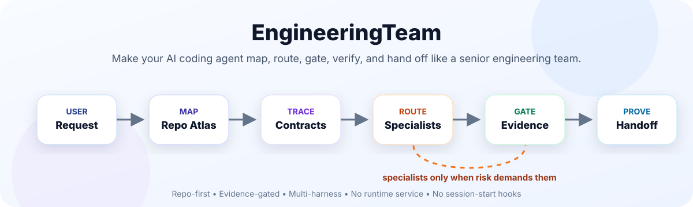
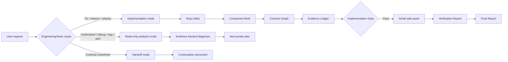
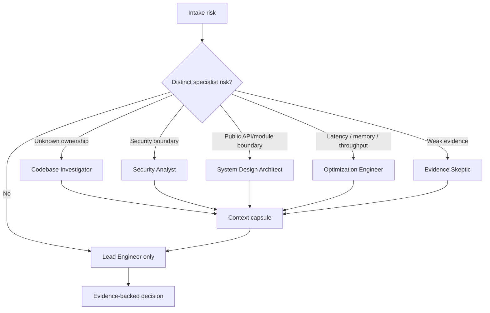

<p align="center">
  <picture>
    <source media="(prefers-color-scheme: dark)" srcset="docs/assets/engineering-team-hero-dark.svg">
    <source media="(prefers-color-scheme: light)" srcset="docs/assets/engineering-team-hero-light.svg">
    
  </picture>
</p>

# EngineeringTeam

[](https://github.com/daeon/EngineeringTeam/actions/workflows/validate.yml)
[](LICENSE)


**Make your AI coding agent behave like a senior engineering team.**

EngineeringTeam is a repo-first workflow layer for AI coding agents. It supports implementation, read-only analysis, and handoff workflows: the agent maps the repo, traces contracts, gathers evidence, routes specialists selectively, gates implementation when edits are requested, verifies changes, and hands off reviewable artifacts before claiming success.

> Stop vibe-coding legacy repos. Make the agent prove it understands the code before it edits.

## ⚡ In thirty seconds

Most coding agents are fast, but speed is not judgment. On a real codebase the hard part is not typing code — it is finding the owning component, understanding the call path, preserving contracts, choosing the smallest safe change, and proving the change works.

EngineeringTeam turns that discipline into a reusable skill that works across the agent you already use. It does not add a runtime service, network calls, or session-start magic. You invoke `engineering-team` when a task deserves a rigorous workflow, and the agent produces compact, human-reviewable artifacts as it goes. Use it for PR-ready implementation work or for read-only investigations where the right answer is a diagnosis, map, hypothesis matrix, log report, or performance probe plan rather than a diff.

Use `handoff` when you want the current task transferred to another agent or a fresh session. It compacts the work into a continuation document with decisions, evidence, open questions, artifact links, suggested skills, and next actions.

Specialist agents (security, architecture, performance, migration, release, verification, evidence skepticism) are **selective, not mandatory**. The workflow routes only the ones a task actually needs.

## 🧠 How it works



## 🧭 Pick the right workflow

| I need to... | Use | Typical output |
|---|---|---|
| Fix, implement, refactor, or prepare a PR | `engineering-team` | Repo Atlas → Component Brief → Contract Graph → Evidence Ledger → Implementation Gate → Verification Report → Final Report |
| Understand an unfamiliar repository | `codebase-analysis` | Component map, call paths, contracts, findings, confidence, unknowns |
| Investigate a bug without patching yet | `debugging-forensics` | Hypothesis matrix, supporting/counter evidence, falsifying probes, fix readiness |
| Analyze logs or noisy failure output | `log-forensics` | Timeline, signals, findings, redactions, ruled-out claims, next probes |
| Investigate latency, throughput, memory, or locking | `performance-forensics` | Measurement frame, hot-path map, bottleneck hypotheses, probe-first recommendations |
| Transfer work to another agent or fresh session | `handoff` | Continuation document with decisions, evidence, risks, suggested skills, and next actions |

The main `engineering-team` skill remains the router. It keeps the existing repo-first implementation workflow for change requests and routes analysis requests to focused read-only skills: `codebase-analysis`, `debugging-forensics`, `log-forensics`, and `performance-forensics`. If an investigation uncovers a likely fix, the agent should hand off an evidence-backed diagnosis and verification strategy before editing unless you explicitly ask it to implement.

## 🧪 Raw agent vs EngineeringTeam

| Raw agent often does this | EngineeringTeam forces this |
|---|---|
| Edits the nearest plausible file | Finds the owning component and call path first |
| Explains after the patch | Produces evidence before the patch |
| Treats tests as optional cleanup | Defines verification before implementation |
| Changes behavior without tracing consumers | Builds a contract graph for behavior changes |
| Dumps long reasoning or loses context | Emits compact, reviewable artifacts |
| Leaves the next session cold | Creates a handoff document another agent can continue from |

## 📏 The rule

No non-trivial edit until the agent can answer:

1. Where does this behavior enter the system?
2. Where is it transformed?
3. Where does it leave?
4. Which contracts and consumers are affected?
5. What evidence supports the diagnosis or design?
6. What proves the change works?

If those are unanswered, the agent keeps mapping instead of editing.

<details>
<summary>Advanced: what the implementation gate checks</summary>

The implementation gate requires the agent to name:

- The files allowed to change.
- The evidence supporting the diagnosis or design.
- The affected contracts and consumers for behavior changes.
- The verification commands or manual checks that prove success.
- The rollback path for risky changes.

If the gate fails, the agent keeps mapping, asks a targeted question, or returns an evidence-backed diagnosis instead of patching prematurely.

</details>

## 🛑 When your agent should not edit yet

Hold off on editing — and let EngineeringTeam map first — when:

- The root cause is not yet backed by evidence.
- The owning component or call path is unknown.
- The change crosses a contract, public API, or module boundary.
- Source, tests, docs, or logs disagree.
- The change touches auth, secrets, shell, filesystem, network, migrations, or release behavior.
- There is no verification path yet.

## 🚀 Quick start

```bash
git clone https://github.com/daeon/EngineeringTeam
cd EngineeringTeam
python3 scripts/doctor.py
npm run validate
```

Then, in your coding agent:

```text
Use engineering-team to investigate this bug. Map the repo first, find the owning component, trace the affected contract graph, and propose the smallest safe fix with verification.
```

For read-only analysis:

```text
Use engineering-team in read-only analysis mode to understand this repository. Route to codebase-analysis, map the main components and contracts, and return an evidence-backed report without editing files.
```

To transfer work to another agent or session:

```text
Use handoff to summarize this task for a fresh agent. Focus the next session on finishing verification and preparing the PR.
```

## 🧑‍💻 Specialist routing



Subagents receive bounded briefs and return compact context capsules, not transcripts. The lead agent stays responsible for the final decision.

## 🎬 Demo

See the worked, runnable example and the talking points:

- `examples/buggy-python-service/` — a small service with a real bug, the raw-agent prompt, the EngineeringTeam prompt, and filled-in expected artifacts.
- `docs/demo-script.md` — 60-second and 5-minute demo scripts, plus a raw-agent vs EngineeringTeam comparison.
- `docs/prompt-cards.md` — copy-paste prompts for implementation, read-only codebase analysis, debugging forensics, log forensics, performance forensics, security, migration, release, architecture, test strategy, and handoff.

## 🔌 Supported harnesses

| Harness | Reads | Status |
|---|---|---|
| Claude Code | `.claude-plugin/plugin.json`, `agents/*.md`, `skills/` | Supported |
| Codex | `.codex-plugin/plugin.json`, `.codex/agents/*.toml`, `skills/` | Supported |
| Cursor | `.cursor-plugin/plugin.json`, `agents/*.md`, `skills/` | Supported |
| Gemini CLI | `gemini-extension.json`, `GEMINI.md`, `AGENTS.md` | Supported |
| OpenCode | `.opencode/plugins/engineering-team.js` | Supported |
| GitHub Copilot | `.github/agents/*.md` | Experimental |

All harnesses point at the same canonical skill bundle under `skills/`, with `skills/engineering-team/SKILL.md` as the main router and focused read-only skills beside it. Native agent definitions are generated from one source of truth (`agents-src/*.yaml`) — see `docs/harness-support.md`.

## 🗂️ Artifact gallery

EngineeringTeam makes the agent produce compact, reviewable artifacts before and after implementation:

| Artifact | What it proves | Example |
|---|---|---|
| Repo Atlas | The agent understands the repo shape, entry points, tests, generated-code rules, and risky areas | [`repo-atlas.md`](examples/buggy-python-service/expected-artifacts/repo-atlas.md) |
| Component Brief | The agent found the owner, key files, symbols, call path, inputs, outputs, and side effects | [`component-brief.md`](examples/buggy-python-service/expected-artifacts/component-brief.md) |
| Contract Graph | The agent traced producer, contract/data shape, consumer, failure mode, coverage, and risk | [`contract-graph.md`](examples/buggy-python-service/expected-artifacts/contract-graph.md) |
| Evidence Ledger | Major claims are backed by source paths, tests, logs, runtime observations, schemas, or docs | [`evidence-ledger.md`](examples/buggy-python-service/expected-artifacts/evidence-ledger.md) |
| Verification Report | Success was checked and residual risk was reported instead of assumed away | [`verification-report.md`](examples/buggy-python-service/expected-artifacts/verification-report.md) |
| Codebase Analysis Report | Read-only analysis produced scope, component map, call paths, contracts, findings, confidence, and unknowns | `codebase-analysis` skill output |
| Debugging Hypothesis Matrix | Bug work is ranked by evidence, counter-evidence, falsifying probes, and fix readiness | `debugging-forensics` skill output |
| Log Forensics Report | Logs become a timeline with signals, findings, redactions, ruled-out claims, and next probes | `log-forensics` skill output |
| Performance Forensics Report | Performance work starts with a measurement frame, hot-path map, bottleneck hypotheses, and probes | `performance-forensics` skill output |
| Handoff Document | Another agent or session can continue with decisions, evidence, open questions, risks, suggested skills, and next actions | `handoff` skill output |

These make the agent's reasoning inspectable: a reviewer can see whether it understood the code path, not just whether the diff looks plausible.

## 📦 Install

`python3 scripts/install.py --target <harness>` is the single entry point. Two targets **copy files**; the rest **print the exact manual setup steps** for their marketplace / extension / plugin model (nothing is copied).

| Harness | What `install.py` does | Mechanism |
|---|---|---|
| Codex | Copies `.codex/agents/*.toml` into the project or user config | File copy (idempotent; `--force` to overwrite) |
| GitHub Copilot | Copies `.github/agents/*.md` into the target repo | File copy (idempotent; `--force` to overwrite) |
| Claude Code | Prints the local-marketplace commands to run | `/plugin marketplace add .` |
| Cursor | Prints the local plugin-source steps | Reads `.cursor-plugin/plugin.json`, `skills/`, `agents/` |
| Gemini CLI | Prints the extension install command | `gemini extensions install .` |
| OpenCode | Prints the plugin path + points to `.opencode/INSTALL.md` | Loads `.opencode/plugins/engineering-team.js` |

### Codex custom agents (file copy)

```bash
python3 scripts/install.py --target codex --scope project --repo .
# or globally:
python3 scripts/install.py --target codex --scope user
```

### GitHub Copilot custom agents (file copy)

```bash
python3 scripts/install.py --target github --scope project --repo /path/to/repo
```

### Claude Code (local marketplace)

```bash
/plugin marketplace add .
/plugin install engineering-team@engineering-team-dev
```

### Cursor / Gemini CLI / OpenCode (manual setup — prints steps, copies nothing)

```bash
python3 scripts/install.py --target cursor --scope project --repo .
python3 scripts/install.py --target gemini --scope project --repo .
python3 scripts/install.py --target opencode --scope project --repo .
```

Gemini CLI installs as an extension:

```bash
gemini extensions install .
```

File-copy installs (Codex, GitHub) are idempotent: existing files are skipped unless you pass `--force`.

## Keeping main context clean

EngineeringTeam uses the main agent as the Lead Engineer. Broad search, noisy test output, and specialist review can be delegated to subagents. Subagents receive bounded briefs and return compact context capsules, not transcripts. This keeps the main session focused on evidence, decisions, implementation gates, and final handoff.

## ✅ Validation

```bash
npm run validate
python3 scripts/doctor.py
```

`npm run validate` runs the same checks as CI: JSON manifests, TOML agents, generated-agent drift including stale generated files, version consistency, OpenCode JS syntax, package structure, no session-start hook regression, and the worked example test suite. The same command runs in GitHub Actions via `.github/workflows/validate.yml`.

## 📚 Documentation

Full docs page: https://github.com/daeon/EngineeringTeam/tree/main/docs

- `docs/design.md` — architecture, design principles, harness boundaries, and adoption model.
- `docs/why-engineeringteam.md` — product value, target users, positioning.
- `docs/getting-started.md` — install, first prompts, expected outputs.
- `docs/workflow.md` — detailed workflow, dataflow, and gates.
- `docs/specialists.md` — specialist role catalog and routing guidance.
- `docs/harness-support.md` — per-harness packaging notes.
- `docs/demo-script.md` — demo scripts and comparison.
- `docs/prompt-cards.md` — copy-paste prompts by task type.

## 🤝 Contributing

See `CONTRIBUTING.md` for how to edit agent sources, regenerate native agents, and validate changes. Security posture is documented in `SECURITY.md`. Planned work is in `ROADMAP.md`.

## ⚖️ License

MIT License. See `LICENSE`.