# EngineeringTeam

EngineeringTeam is a multi-harness AI engineering team for serious software work in existing repositories. It gives coding agents a disciplined workflow for understanding a codebase before changing it: repo mapping, contract tracing, evidence review, implementation gates, specialist review, and verification.

The result is less random patching and more senior-engineering behavior from the agent you already use.

## Why It Exists

Most coding agents are fast, but speed is not the same as judgment. On real codebases, the hard part is usually not writing lines of code. It is finding the owning component, understanding the call path, preserving contracts, choosing the smallest safe change, and proving that the change actually works.

EngineeringTeam turns that discipline into a reusable skill.

Use it when you want your agent to:

- Map an unfamiliar repository before editing.
- Route work to architecture, security, testing, performance, migration, release, documentation, and evidence-review specialists only when useful.
- Capture why a change is safe, not just what changed.
- Avoid broad rewrites, decorative reviews, and test theater.
- Produce concrete artifacts a human reviewer can inspect.
- Work consistently across Claude Code, Codex, Cursor, Gemini CLI, and OpenCode.

## What You Get

- A shared `engineering-team` skill for non-trivial software engineering tasks.
- Specialist agent definitions for harnesses that support custom agents.
- Codex custom-agent TOML templates.
- Repo-intelligence scripts for shallow maps, symbol indexes, test discovery, changed-surface checks, and stale-context checks.
- Templates for repo atlases, component briefs, contract graphs, evidence ledgers, verification reports, and handoffs.
- GitHub Actions validation for package integrity.

## How It Works

```mermaid
flowchart LR
    userRequest[User_Request] --> invokeSkill[Invoke_engineering_team]
    invokeSkill --> classify[Classify_Risk]
    classify --> align[Alignment_Gate]
    align --> mapRepo[Repo_Atlas]
    mapRepo --> componentBrief[Component_Brief]
    componentBrief --> contractGraph[Contract_Graph]
    contractGraph --> evidenceGate[Evidence_Gate]
    evidenceGate --> implement[Smallest_Safe_Change]
    implement --> verify[Verification_Report]
    verify --> handoff[Human_Reviewable_Handoff]
```



EngineeringTeam is intentionally manual. No session-start bootstrap is installed. Invoke `engineering-team` when the task deserves a more rigorous workflow.

## When To Use It

EngineeringTeam is most useful for:

- Bug investigations where the root cause is not obvious.
- Feature work in a repository you do not fully understand yet.
- Legacy code modernization.
- Refactors that may affect contracts, tests, or ownership boundaries.
- Security-sensitive changes involving auth, trust boundaries, input handling, shell, filesystem, network, or secrets.
- Performance work where measurement and attribution matter.
- Migration or compatibility work.
- Release-sensitive changes that need rollback thinking.
- PR or branch reviews that need multiple technical lenses.

Skip the full workflow for typo fixes, obvious one-line edits, and tasks where the user explicitly wants a short answer only.

## Core Artifacts

EngineeringTeam makes the agent produce compact, reviewable artifacts before and after implementation:

- `Repo Atlas`: system type, entry points, build/test commands, generated-code rules, and high-risk areas.
- `Alignment`: resolved decisions, acceptance criteria, non-goals, and repo-answerable questions checked.
- `Component Brief`: owning component, key files/symbols, related tests, inputs, outputs, and side effects.
- `Contract Graph`: producer, contract/data shape, consumer, failure mode, coverage, and risk.
- `Evidence Ledger`: claim, evidence, confidence, and impact.
- `Verification Report`: command, result, important output, failure attribution, and residual risk.

These artifacts are useful because they make the agent's reasoning inspectable. A reviewer can see whether the agent understood the code path, not just whether the diff looks plausible.

## Supported Harnesses

- Claude Code via `.claude-plugin/plugin.json` and `.claude-plugin/marketplace.json`
- Codex via `.codex-plugin/plugin.json`
- Cursor via `.cursor-plugin/plugin.json`
- Gemini CLI via `gemini-extension.json` and `GEMINI.md`
- OpenCode via `.opencode/plugins/engineering-team.js`

All harnesses point at the same canonical skill bundle: `skills/engineering-team/SKILL.md`.

## Quick Start

Use this prompt in your coding agent:

```text
Use engineering-team to investigate this bug. Map the repo first, trace the affected contract graph, identify the smallest safe fix, and verify it.
```

For reviews:

```text
Use engineering-team to review this branch. Route to security, architecture, performance, verification, and evidence skepticism only where relevant.
```

For implementation:

```text
Use engineering-team to implement this feature. Build a repo atlas, component brief, evidence ledger, and verification report before final handoff.
```

## Install

### Claude Code

From this repository root, add the local marketplace and install the plugin:

```bash
/plugin marketplace add .
/plugin install engineering-team@engineering-team-dev
```

### Codex

Install this repository as a local plugin source from Codex's plugin UI or marketplace flow. The Codex manifest is `.codex-plugin/plugin.json` and points to `./skills/`.

Optional Codex custom agents are bundled under `skills/engineering-team/assets/agents/`.

Install them into the current repo:

```bash
python3 skills/engineering-team/scripts/install-custom-agents.py --scope project --repo .
```

Install them globally:

```bash
python3 skills/engineering-team/scripts/install-custom-agents.py --scope user
```

Recommended Codex config:

```toml
[agents]
max_threads = 6
max_depth = 1
```

### Cursor

Install from a local plugin source or marketplace entry that points at this repository. Cursor reads `.cursor-plugin/plugin.json`, `skills/`, and `agents/`.

### Gemini CLI

Install this repository as a Gemini extension:

```bash
gemini extensions install /path/to/EngineeringTeam
```

Gemini loads `GEMINI.md`, which imports the shared `AGENTS.md` guidance.

### OpenCode

See `.opencode/INSTALL.md`.

## Documentation

- `docs/why-engineeringteam.md`: product value, target users, and positioning.
- `docs/getting-started.md`: install, first prompts, and expected outputs.
- `docs/workflow.md`: detailed workflow, dataflow, and gates.
- `docs/specialists.md`: specialist role catalog and routing guidance.
- `docs/harness-support.md`: per-harness packaging notes.

## Repository Layout

```text
skills/engineering-team/     shared skill, references, templates, scripts, assets
agents/                      Claude/Cursor markdown specialist agents
.codex/agents/               Codex TOML specialist agents
.claude-plugin/              Claude plugin manifest and local marketplace
.codex-plugin/               Codex plugin manifest
.cursor-plugin/              Cursor plugin manifest
.opencode/                   OpenCode plugin and install docs
gemini-extension.json        Gemini extension manifest
```

## Validate

```bash
python3 skills/engineering-team/scripts/validate-package.py
python3 scripts/validate-codex-package.py
bash scripts/bump-version.sh --check
node --check .opencode/plugins/engineering-team.js
```

The same checks run in GitHub Actions via `.github/workflows/validate.yml`.

## License

MIT License. See `LICENSE`.
