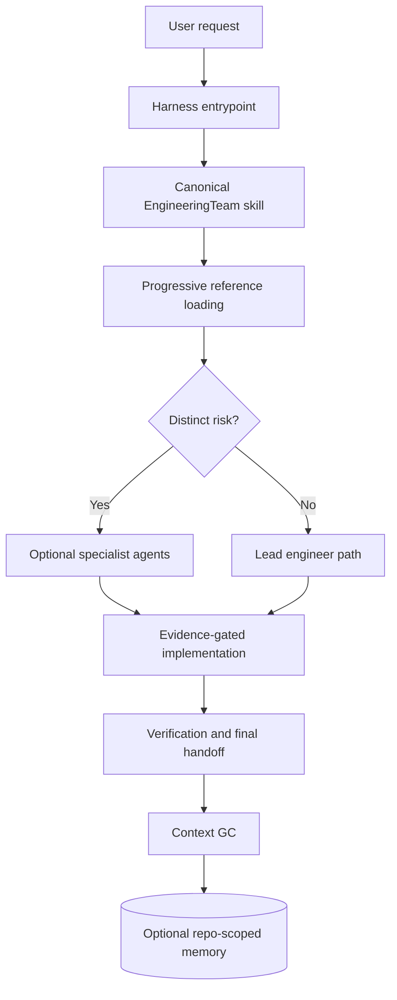
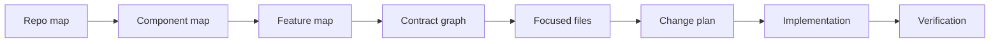
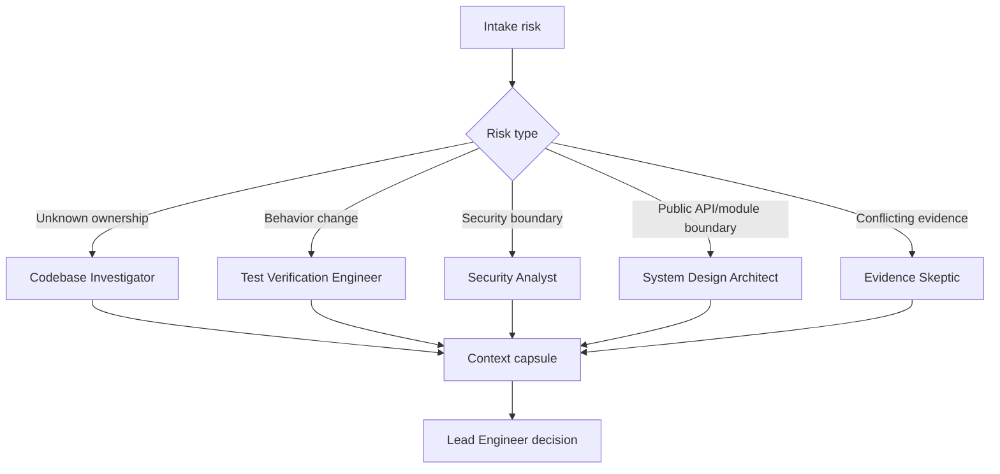
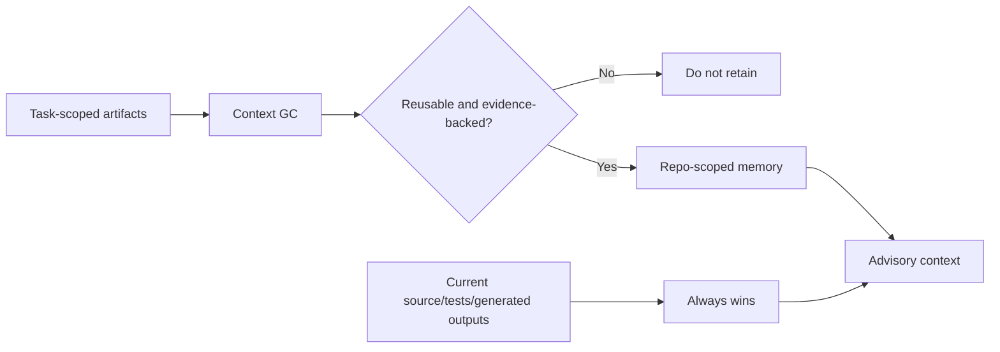

# EngineeringTeam Design

EngineeringTeam is a harness plugin and skill bundle for turning a general coding agent into a repo-first engineering workflow. It does not replace the model, the editor, the terminal, or the project's existing build system. It adds a disciplined operating model around them: map before editing, trace contracts before changing behavior, require evidence for claims, route specialist review only where useful, and verify the result before handoff.

## ⚙️ The Core Problem

Coding agents are often competent at local edits once the target file and desired behavior are clear. Real engineering work is harder because the highest-risk decisions happen before typing:

1. Which component owns the behavior?
2. Which entry point reaches that component?
3. Which data contract is being transformed?
4. Which downstream consumers depend on the current behavior?
5. Which tests actually exercise the affected path?
6. Which constraints come from generated code, migrations, security boundaries, or release policy?

Without a workflow, agents can optimize for speed: edit the nearest file, add a plausible test, and summarize success. EngineeringTeam changes the default: uncertainty must be mapped and retired before implementation.

## 🏗️ Architecture Overview

The repository is organized around a canonical skill bundle and thin harness adapters.

| Layer | Responsibility |
|---|---|
| Root guidance | `AGENTS.md`, `CLAUDE.md`, and `GEMINI.md` tell harnesses how to invoke the repo workflow. |
| Skill bundle | `skills/engineering-team/SKILL.md` defines the primary workflow and links to detailed references. |
| References | `skills/engineering-team/references/` holds focused guidance for intake, routing, repo mapping, contracts, verification, and handoff. |
| Templates | `skills/engineering-team/templates/` provides compact artifact formats. |
| Specialist sources | `agents-src/*.yaml` is the source of truth for specialist role definitions. |
| Generated agents | Harness-native agent files are generated into `.codex/`, `agents/`, `.github/`, and bundled skill assets. |
| Validation | `npm run validate` checks manifests, generated-agent drift, version sync, and plugin syntax. |

## 🔌 Harness Plugin Model

EngineeringTeam is packaged as a harness plugin because teams rarely use only one AI coding environment. The plugin provides a consistent workflow while allowing each harness to load skills and agents in its native format.

Supported harness surfaces include:

- Claude Code plugin manifests and Markdown agents.
- Codex plugin metadata, skills, and TOML custom agents.
- Cursor plugin metadata and Markdown agents.
- Gemini extension metadata plus shared root guidance.
- OpenCode plugin that appends the repo skill path.
- GitHub Copilot custom-agent definitions generated from the shared sources.

The design keeps harness-specific files shallow. The canonical behavior lives in the skill and references, so improvements to the workflow can be made once and distributed consistently.

## 🧭 Workflow Design

EngineeringTeam uses a narrowing workflow:

The important design choice is sequencing. The agent should not start with a patch. It should first produce enough context to make the patch reviewable.

### 1️⃣ Intake And Risk

The agent restates the task as an engineering problem, identifies unknowns, and classifies risk. This controls how much process is needed. A local typo can use a fast path; a behavior change across API boundaries needs contract tracing and stronger verification.

### 2️⃣ Repo Atlas

The repo atlas is a shallow, task-scoped map of the system. It records languages, entry points, test commands, generated-code conventions, project instructions, and high-risk areas. It prevents the agent from treating an unfamiliar repository as a blank text directory.

### 3️⃣ Component Brief

The component brief narrows from repository to owner. It identifies relevant files, symbols, call paths, nearby tests, similar patterns, inputs, outputs, and side effects. This is the minimum useful context before most implementation work.

### 4️⃣ Contract Graph

For behavior changes, EngineeringTeam traces producer-to-consumer edges. The graph captures data shape, ownership, error behavior, compatibility concerns, coverage, and failure modes. This makes it harder to accidentally change public behavior while only checking the edited file.

### 5️⃣ Evidence Ledger

The evidence ledger separates claims from assumptions. A claim is useful only when backed by source paths, symbols, tests, logs, runtime observations, schemas, or docs. Unsupported ideas remain hypotheses until verified.

### 6️⃣ Implementation Gate

The implementation gate names the files allowed to change, evidence for the design, affected contracts, verification plan, and rollback path. It is a deliberate pause before writes.

### 7️⃣ Verification And Handoff

Verification starts narrow and expands only when risk justifies it. The final handoff reports the changed files, commands run, residual risk, and reusable context that should be preserved.

## 🧑‍💻 Specialist Routing Design

EngineeringTeam does not require a large team for every task. The lead agent selects specialists when a distinct risk needs a distinct lens.

Examples:

| Risk | Useful specialist |
|---|---|
| Unknown repository ownership | Codebase Investigator |
| Unsupported or conflicting evidence | Evidence Skeptic |
| Behavior change or regression | Test Verification Engineer |
| Trust boundary, auth, inputs, secrets | Security Analyst |
| Module boundary or public API | System Design Architect |
| Compatibility or schema migration | Migration Analyst |
| Latency, throughput, memory, locking | Optimization Engineer |
| Production rollout or rollback | Release Rollback Engineer |
| Documentation, CLI, onboarding | DX Documentation Reviewer |
| L4/L5 or assumption-heavy decision | Advisor Consultant |

Subagents are bounded by context capsules. They return findings, evidence, risk, and recommended next action instead of transcripts. The lead agent remains responsible for the final decision.

## 🧠 Memory And Context Design

EngineeringTeam distinguishes between task-scoped artifacts and durable memory.

- Task-scoped artifacts are temporary and usually live under `.agent-state/`.
- Repo-scoped memory can live under `.engineering-team/memory/` when the repository opts in.
- Durable memory is advisory. Current source code, tests, generated outputs, and user instructions always win.
- Memory entries must include evidence/source paths.
- Secrets, credentials, private user information, temporary logs, and speculation do not belong in memory.

This design avoids turning memory into stale authority. Memory helps agents start faster, but the repository remains the source of truth.

## 🛡️ Safety Model

EngineeringTeam's safety model is based on friction at the right moments:

- **Before edits:** require ownership, call path, contracts, evidence, and verification strategy.
- **During edits:** prefer the smallest safe patch and avoid unrelated cleanup.
- **After edits:** run meaningful checks and classify failures before changing course.
- **At closeout:** preserve only reusable, evidence-backed context.

This is especially valuable for security-sensitive work, generated code, migrations, public APIs, release behavior, and performance-sensitive paths.

## 🚀 Why Use A Harness Plugin Instead Of A Prompt?

A single prompt can remind an agent to be careful, but a harness plugin is easier to reuse and maintain:

- **Consistency:** every supported harness points to the same canonical skill bundle.
- **Installability:** teams can add the workflow to projects or user environments instead of copying prompts.
- **Maintainability:** validation catches stale generated agents and broken manifests.
- **Progressive disclosure:** detailed references stay available without bloating every session.
- **Team alignment:** prompts, specialists, templates, and package metadata evolve together.
- **Reviewability:** artifacts create a shared language for human reviewers and agents.

The result is less reliance on one perfect prompt and more reliance on a repeatable engineering process.

## ✅ Adoption Guidance

Use EngineeringTeam when a wrong answer would come from missing context rather than missing syntax:

- Debugging unfamiliar code.
- Changing behavior across component or API boundaries.
- Reviewing a risky branch.
- Planning migrations.
- Touching security, permissions, secrets, shell, filesystem, or network behavior.
- Optimizing performance-sensitive paths.
- Preparing release or rollback-sensitive changes.

Do not use the full workflow for obvious one-line edits. The design intentionally supports a fast path so the process stays proportional to risk.

## 🛠️ Maintenance Model

The package is maintained like code:

- Edit specialist sources in `agents-src/*.yaml`.
- Regenerate harness-native agents with `python3 scripts/generate-agents.py`.
- Validate package structure and generated drift with `npm run validate`.
- Keep root guidance concise and move detailed behavior into the skill references.
- Prefer evidence-backed docs updates over broad marketing copy.

This keeps the plugin useful as both an installable product and a living engineering practice.
