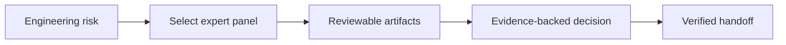

# Why EngineeringTeam

EngineeringTeam is built for the gap between "agent can write code" and "agent can safely operate like a software engineering team in a real codebase."

Modern coding agents are strongest when the task is local and well specified. They are weaker when the work requires several engineering lenses at once: repository orientation, contract awareness, risk classification, verification strategy, and evidence review. EngineeringTeam gives the agent a repeatable operating model for assembling the right expert panel, getting that panel oriented, and making only the smallest safe move.

## 🧩 The Problem

In mature repositories, most failures come from missing team judgment, not missing syntax.

Common agent failure modes:

- Acting like a lone implementer instead of selecting the right expert lenses.
- Editing before finding the real owner of a behavior.
- Fixing the symptom while missing the interaction boundary.
- Reading docs but not checking code and tests.
- Changing a public contract without mapping consumers.
- Adding tests that do not exercise the actual path.
- Treating security, performance, migration, or release concerns as afterthoughts.
- Reporting success without fresh verification or skeptical review.

EngineeringTeam exists to make those failures harder. It inserts a lightweight engineering team harness between the request and the edit, so the lead agent has to route specialists, expose ownership, map contracts, gather evidence, and define verification before it changes the repo.

## 🔌 Why A Harness Plugin Helps

A prompt can ask an agent to be careful once. A harness plugin makes the team discipline reusable across sessions, repositories, and tools. EngineeringTeam packages the workflow, specialist roles, templates, validation scripts, and harness manifests together so teams do not have to rebuild the same expert-routing guardrails for every agent environment.

This matters because agent failures are usually process failures:

- The agent never chose the right specialist lens for the risk.
- The agent did not know which contract it was changing.
- The agent optimized for an edit before finding the owner.
- The agent used stale documentation as authority.
- The agent produced a plausible patch without a meaningful verification path.

EngineeringTeam turns those risks into explicit routing decisions, gates, and artifacts. Human reviewers can inspect which experts were involved, what they believed, what evidence supported it, and which checks exercised the changed behavior.

## 💎 The Value

EngineeringTeam helps a coding agent behave like a small software team:

- A lead engineer scopes the task, selects the smallest useful panel, and owns the final decision.
- A codebase investigator maps the repo and finds ownership.
- An evidence skeptic challenges unsupported claims before the team commits to a direction.
- A verification engineer designs and interprets tests.
- Domain specialists join only when security, performance, migration, architecture, or release risk justifies them.
- An advisor can gate high-risk decisions before implementation.

The workflow is intentionally conservative. It optimizes for reviewable, safe, evidence-backed changes instead of maximum agent activity or a fixed swarm of agents.

## 👥 Who It Is For

EngineeringTeam is useful for:

- Engineers who want AI help that behaves less like autocomplete and more like an expert review panel.
- Teams using AI on legacy or unfamiliar codebases.
- Teams that need agent output to survive human review.
- Maintainers who want fewer broad rewrites and more focused patches.
- Consultants doing repo triage, audits, migrations, or performance work.
- Organizations that want one reusable AI workflow across multiple coding-agent harnesses.

## 📦 What Makes It Sellable

EngineeringTeam is not just a prompt pack. It is a packaged engineering-team harness:

- Multi-harness distribution for Claude Code, Codex, Cursor, Gemini CLI, and OpenCode.
- A lead-engineer workflow that routes specialists by task risk instead of spawning a fixed committee.
- Shared canonical skill content so behavior stays consistent across tools.
- Specialist agents in both Markdown and Codex TOML formats.
- Scripted validation and repo-intelligence helpers.
- GitHub Actions checks so the package can be maintained like a real product.
- Progressive-disclosure references and templates, so the core skill stays usable without becoming a giant memory dump.

## ✅ Practical Outcomes

Teams can use EngineeringTeam to get:

- Better expert selection for each AI-assisted engineering task.
- Faster onboarding to unknown repositories.
- Safer bug fixes with explicit evidence and verification.
- Better PR reviews with risk-specific specialist lenses.
- More reliable migration and compatibility analysis.
- Cleaner handoffs from AI work to human review.

The product promise is simple: EngineeringTeam gives your coding agent the right expert panel, makes that panel understand the problem, and then helps it move only as far as the evidence supports.

## 📐 Design Documentation

For the deeper architecture, safety model, memory model, and harness-plugin rationale, see `docs/design.md`.
