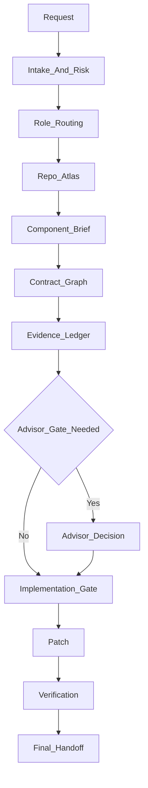

# EngineeringTeam Workflow

EngineeringTeam is a staged workflow. Each stage narrows uncertainty before the agent is allowed to change code.

## Dataflow



## Stage 1: Intake And Risk

The agent restates the task in engineering terms and classifies:

- Requested outcome.
- Known files, symptoms, or components.
- Risk level.
- Unknowns that must be resolved from the repo.
- Expected deliverable.

The risk classification decides whether the task needs a full specialist route or a lightweight lead-only pass.

## Stage 2: Role Routing

EngineeringTeam does not spawn a fixed team by default. It scores candidate roles and uses only the smallest set that covers distinct risks.

Examples:

- Unknown repo impact: Codebase Investigator.
- Behavior change: Test Verification Engineer.
- Security boundary: Security Analyst.
- Public API or module boundary: System Design Architect.
- Migration or compatibility: Migration Analyst.
- Production behavior: Release Rollback Engineer.
- Unclear evidence: Evidence Skeptic or Advisor Consultant.

## Stage 3: Repo Atlas

The repo atlas is a shallow map of the system:

- Main languages and frameworks.
- Runtime and build model.
- Entry points.
- Test surfaces.
- Generated-code rules.
- Config and schema sources.
- External integrations.
- Repo-specific instructions.

The goal is orientation, not exhaustive documentation.

## Stage 4: Component Brief

The component brief narrows the map to the relevant behavior:

- Owning component.
- Important files and symbols.
- Main call path.
- Related tests.
- Similar existing patterns.
- Inputs, outputs, and side effects.
- Open questions.

This is the minimum artifact before local edits.

## Stage 5: Contract Graph

Behavior changes require contract awareness. EngineeringTeam traces producer-to-consumer edges:

```text
source -> adapter -> contract -> domain operation -> side effect -> observable output -> verification
```

For each edge, the agent records data shape, ownership, error behavior, compatibility risk, coverage, and failure mode.

## Stage 6: Evidence Ledger

Every major claim must point to evidence:

- Source path.
- Symbol reference.
- Test result.
- Log excerpt.
- API contract.
- Runtime observation.
- Documented behavior.

Unsupported claims remain assumptions.

## Stage 7: Implementation Gate

The agent may edit only after the gate passes:

- Scope is clear.
- Files allowed to change are named.
- Evidence supports the diagnosis or design.
- Contract edges are known for behavior changes.
- Tests or verification commands are defined.
- Rollback path is understood for risky work.

## Stage 8: Verification And Handoff

Verification starts narrow, then expands only when risk justifies it:

1. Fast static checks.
2. Targeted unit tests.
3. Regression tests.
4. Integration or system checks.
5. Security, performance, migration, or manual checks when relevant.

The final handoff reports what changed, what was verified, what remains risky, and what reusable repo knowledge should be preserved.
