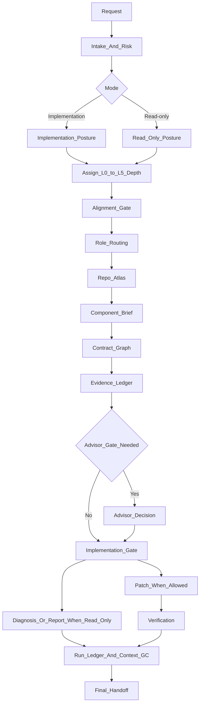
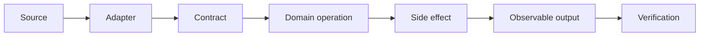
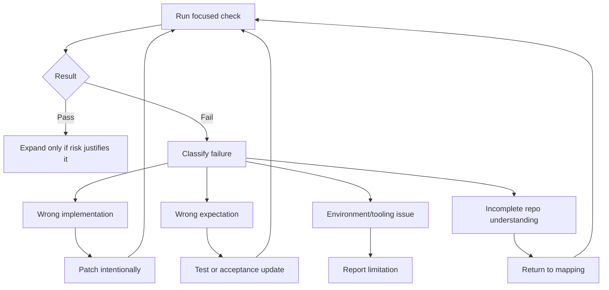

# EngineeringTeam Workflow

EngineeringTeam is a staged workflow. Each stage narrows uncertainty before the agent is allowed to change code or make broad read-only claims.

## 🗺️ Dataflow

## 💡 Why The Workflow Exists

The workflow is not ceremony for its own sake. It counters the most expensive failure mode in agent-assisted engineering: acting confidently with incomplete repository context. Each stage retires a different kind of uncertainty:

- Intake retires ambiguity about the requested outcome.
- Mode selection retires ambiguity about whether edits are allowed.
- Autonomy depth retires ambiguity about how much evidence and review are required.
- Repo Atlas retires uncertainty about project shape and local rules.
- Component Brief retires uncertainty about ownership and call path.
- Contract Graph retires uncertainty about consumers and compatibility.
- Evidence Ledger retires unsupported claims.
- Implementation Gate retires accidental broad edits.
- Verification retires unproven success.
- Context GC retires noisy session context while preserving only reusable knowledge.

For small, obvious edits or local explanations, EngineeringTeam can take a fast path. For risky changes or broad read-only investigations, the workflow creates a reviewable trail from user request to validated patch, diagnosis, or next-probe plan.

## 1️⃣ Stage 1: Intake And Risk

The agent restates the task in engineering terms and classifies:

- Requested outcome.
- Mode: read-only or implementation.
- Known files, symptoms, or components.
- Risk level.
- Unknowns that must be resolved from the repo.
- Expected deliverable.

Read-only mode does not automatically mean L0. Mode controls whether edits are allowed. The L0-L5 level controls depth, uncertainty, and review.

The risk classification decides whether the task needs a full specialist route or a lightweight lead-only pass.

## 1.1️⃣ L0 Fast Path Boundary

Use L0 only for trivial local explanation, simple summary, or obvious one-file inspection with no cross-file, behavior, contract, performance, security, migration, release, or production claims.

Do not classify these as L0 by default:

- codebase audits
- architecture surveys
- root-cause investigations
- debugging forensics
- log forensics
- performance investigations
- security reviews
- migration or compatibility analysis
- release or production analysis
- PR or diff reviews involving behavior, API, tests, generated code, or multiple files

Those requests may still be read-only, but they should be classified as L2-L5 according to breadth and risk.

## 1.5️⃣ Stage 1.5: Alignment Gate

For ambiguous scope, behavior, terminology, acceptance criteria, or L3+ risk, the agent resolves user intent before routing too deeply:

- Ask one question at a time.
- Include a recommended answer.
- Inspect the repository instead of asking when code, tests, or docs can answer.
- Stop when acceptance criteria, non-goals, and verification signals are clear.

## 2️⃣ Stage 2: Role Routing

EngineeringTeam does not spawn a fixed team by default. It scores candidate roles and uses only the smallest set that covers distinct risks.

Examples:

- Unknown repo impact: Codebase Investigator.
- Behavior change: Test Verification Engineer.
- Security boundary: Security Analyst.
- Public API or module boundary: System Design Architect.
- Migration or compatibility: Migration Analyst.
- Production behavior: Release Rollback Engineer.
- Unclear evidence: Evidence Skeptic or Advisor Consultant.

When a task is broad, noisy, or specialist-heavy, the Lead Engineer delegates bounded work to subagents using `templates/subagent-brief.md`. Each subagent returns a compact context capsule. The Lead Engineer uses capsules as evidence and owns the final decision.

## 3️⃣ Stage 3: Repo Atlas

The repo atlas is a shallow map of the system:

- Main languages and frameworks.
- Runtime and build model.
- Entry points.
- Test surfaces.
- Domain context and relevant ADRs, when present.
- Generated-code rules.
- Config and schema sources.
- External integrations.
- Repo-specific instructions.

The goal is orientation, not exhaustive documentation.

Domain docs are a soft dependency. If a `CONTEXT.md`, `CONTEXT-MAP.md`, or ADRs exist, EngineeringTeam uses that vocabulary and respects durable decisions. If they are absent, the workflow continues with code-first evidence.

## 4️⃣ Stage 4: Component Brief

The component brief narrows the map to the relevant behavior:

- Owning component.
- Important files and symbols.
- Main call path.
- Related tests.
- Similar existing patterns.
- Inputs, outputs, and side effects.
- Open questions.

This is the minimum artifact before local edits or bounded component-level claims.

## 5️⃣ Stage 5: Contract Graph

Behavior changes and behavior-level investigations require contract awareness. EngineeringTeam traces producer-to-consumer edges:

For each edge, the agent records data shape, ownership, error behavior, compatibility risk, coverage, and failure mode.

## 6️⃣ Stage 6: Evidence Ledger

Every major claim must point to evidence:

- Source path.
- Symbol reference.
- Test result.
- Log excerpt.
- API contract.
- Runtime observation.
- Documented behavior.

Unsupported claims remain assumptions.

## 7️⃣ Stage 7: Implementation Gate

The agent may edit only after the gate passes:

- Scope is clear.
- Files allowed to change are named.
- Evidence supports the diagnosis or design.
- Contract edges are known for behavior changes.
- Tests or verification commands are defined.
- Rollback path is understood for risky work.

For read-only mode, this stage produces a diagnosis, analysis report, or next-probe plan instead of a patch.

## 8️⃣ Stage 8: Verification, Run Ledger, And Handoff

Verification starts narrow, then expands only when risk justifies it:

1. Fast static checks.
2. Targeted unit tests.
3. Regression tests.
4. Integration or system checks.
5. Security, performance, migration, or manual checks when relevant.

Use a Run Ledger when the task needs a reviewable trace of route decisions, agents used, probes, evidence, verification, handoff state, or residual risk. The Run Ledger is task-scoped evidence, not durable memory.

At closeout, Context GC extracts memory candidates and applies memory-promotion rules. Only reusable, evidence-backed knowledge should enter `.engineering-team/memory/`.

The final handoff reports what changed or what was diagnosed, what was verified or still needs probing, what remains risky, and what reusable repo knowledge should be preserved.

For bug investigations, EngineeringTeam builds a deterministic feedback loop before fixing. For test-first work, it uses vertical tracer-bullet cycles: one public-interface behavior test, minimal implementation, then the next behavior.
