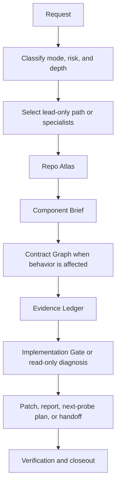

# EngineeringTeam Workflow

EngineeringTeam is a staged, repo-first operating model: map the system, narrow to the owning component, trace the affected contract, gather evidence, then either make the smallest safe change or hand back a diagnosis. This page explains the public rationale and points to the canonical operational files that agents should follow.

## Canonical Source Of Truth

Do not copy procedural workflow steps from this document into agent prompts. The executable guidance lives in the skill bundle:

| Need | Canonical file |
|---|---|
| Main router, mode selection, and workflow order | [`skills/engineering-team/SKILL.md`](../skills/engineering-team/SKILL.md) |
| Intake, mode, risk, and autonomy depth | [`skills/engineering-team/references/intake-risk.md`](../skills/engineering-team/references/intake-risk.md) |
| Read-only analysis routing | [`skills/engineering-team/references/analysis-routing.md`](../skills/engineering-team/references/analysis-routing.md) |
| Specialist routing | [`skills/engineering-team/references/agent-routing.md`](../skills/engineering-team/references/agent-routing.md) |
| Repo and component mapping | [`skills/engineering-team/references/repo-atlas.md`](../skills/engineering-team/references/repo-atlas.md), [`skills/engineering-team/references/component-brief.md`](../skills/engineering-team/references/component-brief.md) |
| Contract and evidence gates | [`skills/engineering-team/references/contract-graph.md`](../skills/engineering-team/references/contract-graph.md), [`skills/engineering-team/references/evidence-ledger.md`](../skills/engineering-team/references/evidence-ledger.md), [`skills/engineering-team/references/implementation-gate.md`](../skills/engineering-team/references/implementation-gate.md) |
| Verification, final handoff, and memory promotion | [`skills/engineering-team/references/verification-loop.md`](../skills/engineering-team/references/verification-loop.md), [`skills/engineering-team/references/final-report.md`](../skills/engineering-team/references/final-report.md), [`skills/engineering-team/references/memory-promotion.md`](../skills/engineering-team/references/memory-promotion.md) |

When the workflow changes, update the skill/reference files first. Public docs should summarize the concept and link back here rather than duplicating the full procedure.

## Dataflow At A Glance

The important design choice is sequencing. EngineeringTeam should not start with a broad claim or patch. It first builds enough repository context for a reviewer to understand why the change, diagnosis, or next probe is justified.

## Why The Workflow Exists

The workflow counters the most expensive failure mode in agent-assisted engineering: acting confidently with incomplete repository context.

- **Intake and routing** keep the agent honest about the requested outcome, edit posture, risk, and whether specialists are useful.
- **Repo and component mapping** prevent the agent from treating an unfamiliar repository as a loose set of files.
- **Contract and evidence artifacts** make behavior changes reviewable by tying claims to source paths, tests, logs, schemas, or docs.
- **Implementation and verification gates** create a deliberate pause before writes and require proof after the change.
- **Run ledgers and memory promotion** keep task-specific traces separate from reusable, evidence-backed repo knowledge.

For small, obvious local work, the skill supports a fast path so the process stays proportional. For risky changes or broad read-only investigations, the workflow creates a trail from user request to validated patch, diagnosis, or next-probe plan.

## Public-Facing Outputs

EngineeringTeam produces compact artifacts that reviewers can inspect without reading a full agent transcript:

| Artifact | Public purpose | Canonical reference/template |
|---|---|---|
| Repo Atlas | Shows the agent understands repo shape, entry points, tests, generated-code rules, and local instructions. | [`references/repo-atlas.md`](../skills/engineering-team/references/repo-atlas.md) |
| Component Brief | Shows the agent found the owner, files, symbols, call path, related tests, and side effects. | [`references/component-brief.md`](../skills/engineering-team/references/component-brief.md) |
| Contract Graph | Shows producer-to-consumer behavior, data shape, failure mode, coverage, and compatibility risk. | [`references/contract-graph.md`](../skills/engineering-team/references/contract-graph.md) |
| Evidence Ledger | Separates supported claims from assumptions. | [`references/evidence-ledger.md`](../skills/engineering-team/references/evidence-ledger.md) |
| Verification Report | Records checks run, failures attributed, gaps, and residual risk. | [`references/verification-loop.md`](../skills/engineering-team/references/verification-loop.md) |
| Run Ledger | Captures task-scoped route decisions, probes, evidence, verification, and handoff state when a run needs traceability. | [`references/run-ledger.md`](../skills/engineering-team/references/run-ledger.md) |

See `examples/buggy-python-service/expected-artifacts/` for filled examples from the demo project.
