# Read-Only Analysis Routing

Use this reference when a request asks to analyze, understand, investigate, debug, inspect logs, or profile performance without an explicit implementation request.

## Mode selection

| User intent | Route | Default edit posture | Primary output |
|---|---|---|---|
| Fix, change, implement, refactor, add tests, prepare PR | EngineeringTeam implementation workflow | Edits allowed only after the Implementation Gate | Verified implementation report |
| Understand repository, explain architecture, audit design, map ownership | `codebase-analysis` | Read-only | Codebase analysis report |
| Debug issue, triage failure, find root cause, interpret stack trace | `debugging-forensics` | Read-only | Hypothesis matrix + next-probe plan |
| Analyze logs, incidents, alerts, operational traces | `log-forensics` | Read-only and redact-sensitive | Log forensics report |
| Investigate latency, throughput, memory, CPU, IO, contention | `performance-forensics` | Read-only and measurement-first | Performance forensics report |
| Transfer active context | `handoff` | Read-only unless task says otherwise | Continuation handoff |

If a read-only investigation discovers a likely fix, stop at an implementation handoff unless the user has asked for changes. The handoff should include confirmed evidence, affected contracts, proposed files to change, and verification strategy.

Two L0 report shapes, by intent: descriptive "understand / map this repo" requests use the `codebase-analysis` skill and produce a **Codebase Analysis Report** (`templates/codebase-analysis-report.md`); evaluative audits, feedback, and "what could be improved" requests use the engineering-team L0 fast path and produce an **Analysis Report** (`templates/analysis-report.md`).

## Routing graph

```mermaid
flowchart TD
    U[User request] --> ET[engineering-team]

    ET -->|Fix / change / implement| IMPL[Implementation workflow]
    ET -->|Understand repo| CA[codebase-analysis]
    ET -->|Debug issue| DF[debugging-forensics]
    ET -->|Analyze logs| LF[log-forensics]
    ET -->|Investigate performance| PF[performance-forensics]
    ET -->|Transfer task| HO[handoff]

    CA --> CCA[Codebase Cartographer]
    CA --> SDA[System Design Architect]

    DF --> RTA[Runtime Trace Analyst]
    DF --> RE[Reproduction Engineer]
    DF --> ES[Evidence Skeptic]

    LF --> LFA[Log Forensics Analyst]
    LF --> OA[Observability Architect]
    LF --> ES

    PF --> PI[Performance Investigator]
    PF --> RTA
    PF --> OA
    PF --> ES

    IMPL --> SDA
    IMPL --> SA[Security Analyst]
    IMPL --> TVE[Test Verification Engineer]
    IMPL --> RR[Release / Rollback Engineer]

    CA --> HR[Analysis report]
    DF --> HM[Hypothesis matrix + next probe plan]
    LF --> LR[Log forensics report]
    PF --> PR[Performance forensics report]
    IMPL --> VR[Verified implementation report]
    HO --> HD[Continuation handoff]
```

## Read-only analysis rules

- Preserve repo-first behavior: map broad-to-narrow before claiming root cause or design facts.
- Keep evidence gates: every important claim cites files, commands, logs, metrics, or clearly labeled assumptions.
- Do not run destructive commands or change files during read-only analysis.
- Prefer smallest useful probes: commands should answer a specific hypothesis and avoid absorbing large raw logs into context.
- Use specialist agents only when the question is bounded and the result can return as a compact context capsule.
- Use `templates/next-probe-plan.md` whenever evidence is insufficient for a confident conclusion.
